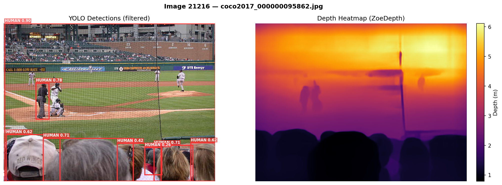
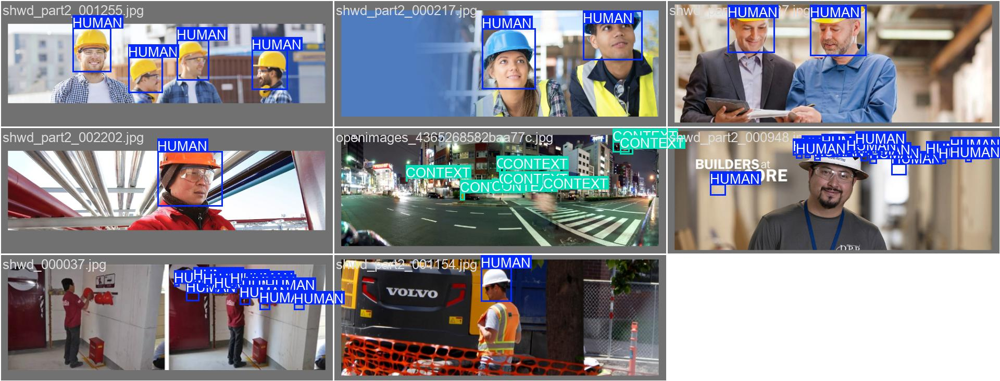
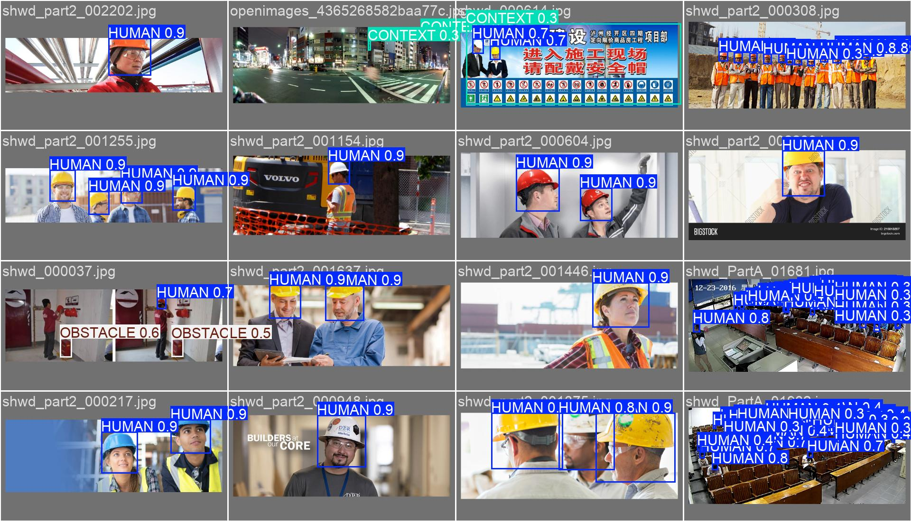

# R3F: Robust Robot Reasoning Framework

**A Hybrid Neuro-Symbolic Pipeline for Autonomous Robot Navigation Safety**

### The Problem & Solution

Autonomous robots must make split-second, safety-critical decisions, but monocular cameras lack native depth, and large reasoning models (LLMs) are too slow for real-time edge deployment. Most approaches sacrifice either accuracy, speed, or explainability.

**R3F solves this.** We extract 2D semantics and relative depth, compile it into a spatial-symbolic graph, use a heavy LLM to reason about warehouse safety offline, and distill that logic into a lightning-fast Graph Neural Network (GNN). The result: **LLM-level reasoning and explainability executing at millisecond speeds on edge hardware.**

-----

## ⚡ R3F in Action: From Pixels to Logic

Instead of a black-box decision, R3F builds a fully transparent reasoning pipeline. Here is exactly what the robot "sees" and "thinks" during a critical encounter.

### 1\. Dual Perception (Vision + Depth)

The system simultaneously extracts bounding boxes and normalized relative depth to bypass monocular scale ambiguity.



*(Left: Fine-tuned YOLOv11 detections. Right: Depth Anything V2 relative depth map)*

### 2\. The 3D Scene Reconstruction

Bounding boxes are fused with median depth values to create a spatial understanding of the scene (`outputs/21216/scene_3d.json`).

```json
[
  {
      "tag": "HUMAN",
      "class_id": 0,
      "confidence": 0.905,
      "bbox_xyxy": [2.1, 0.0, 500.0, 374.4],
      "horizontal_bin": "CENTER",
      "depth_bin": "CLOSE",
      "depth_m": 1.01
    },
    {
      "tag": "HUMAN",
      "class_id": 0,
      "confidence": 0.784,
      "bbox_xyxy": [75.8, 141.6, 106.4, 226.8],
      "horizontal_bin": "LEFT",
      "depth_bin": "MID",
      "depth_m": 6.5
    },
    ...
]
```

### 3\. Spatial-Symbolic Graph

The physical geometry is translated into discrete semantic logic—no heavy point clouds required.

> `HUMAN_1 is CENTER and CLOSE. HUMAN_2 is LEFT and MID. HUMAN_3 is CENTER and CLOSE. HUMAN_4 is RIGHT and MID. HUMAN_5 is LEFT and MID. HUMAN_6 is RIGHT and MID. HUMAN_7 is CENTER and MID...`

### 4\. Lightning Apprentice Decision (Real-Time GNN)

The GNN processes the graph and outputs the safest action, confidence, and the exact spatial relationships that triggered the decision.

```json
{
  "action": "STOP",
  "confidence": 1.0,
  "reasoning": "HUMAN detected [MID] [TO THE RIGHT OF] [ROBOT]. HUMAN detected [MID] [TO THE RIGHT OF] [ROBOT]. HUMAN detected [MID] [TO THE RIGHT OF] [ROBOT]."
},
```

-----

## 🚀 Built for the Edge: Performance Metrics

R3F is not just a theoretical framework; it is engineered for high-speed edge deployment.

  * **Inference Speed:** Processed the entire unannotated test set (**\~3,500 images**) in just **12 minutes** end-to-end.
  * **Zero-Latency Reasoning:** The 1-layer GraphSAGE GNN executes reasoning in sub-milliseconds on CPU.
  * **Rapid Training Pipeline:**
      * YOLOv11 Fine-tuning (4 macro-classes): \~2 hours
      * GNN Student Training (500 epochs): \~20 minutes

-----

## 🛡️ Beyond Accuracy: Fixing Dataset Bias

During validation analysis, we found that the dataset's automated annotations were highly inconsistent, particularly when bounding diverse groups of people. Because our fine-tuned YOLO model leveraged robust pre-trained weights to generalize across the HUMAN macro-class, **our pipeline was able to actively correct the poor automated labeling and generate highly accurate bounding boxes**.

| Ground Truth (Biased) | R3F Predictions (Unbiased) |
| :---: | :---: |
|  |  |

*Above: Ground truth annotations (Left) missing critical human detections compared to R3F's robust predictions (Right).*

-----

## 🧠 How It Works: The Architecture

R3F operates in 6 sequential phases.

1.  **Phase 0 (Data Preprocessing):** Parses COCO-format annotations and collapses 27 raw categories into 4 safety-relevant macro-classes (`HUMAN`, `VEHICLE`, `OBSTACLE`, `CONTEXT`).
2.  **Phase 1 (Dual Perception - Vision):** Fine-tunes YOLOv11 Nano for high-speed, lightweight 2D semantic detection.
3.  **Phase 2 (Dual Perception - Depth):** Utilizes Depth Anything V2 to extract normalized (0.0 to 1.0) relative depth maps.
4.  **Phase 3 (Spatial-Symbolic Compiler):** Fuses bounding boxes with center-cropped depth values to build a lightweight 3D scene dictionary.
5.  **Phase 4 (Reliable Reasoning Tutor):** Offline knowledge generation. Claude Sonnet 4.6 evaluates the scene graphs using a `<thinking>` Chain-of-Thought protocol to generate optimal actions and "reasoning edges" based on warehouse safety rules.
6.  **Phase 5 (Lightning Apprentice):** Trains a PyTorch Geometric GraphSAGE model on the LLM's outputs using a Joint-Loss formulation (Action Classification + Binary Edge Prediction).

-----

## 💻 CLI Reference & Installation

### Prerequisites

  * Python `~=3.10.0`
  * CUDA 12.6+ (for GPU training)
  * `uv` package manager

### Setup

```bash
git clone https://github.com/nicolasvillagranp/reservoir-bots.git
cd theker-hack
uv sync
```

### Running the Pipeline

You can run the pipeline phase-by-phase. Configuration adapts automatically based on the `PIPELINE_MODE` environment variable (`test` or `production`).

```bash
# 1. Prepare Data
uv run python -m src.phases.phase0_data

# 2. Fine-tune Object Detector
uv run python -m src.phases.phase1_vision

# 3. Verify Depth Extraction
uv run python -m src.phases.phase2_depth

# 4. Generate Spatial-Symbolic Graphs
uv run python -m src.phases.phase3_fusion

# 5. Generate LLM Training Data (Requires ANTHROPIC_API_KEY)
uv run python -m src.phases.phase4_symbolic

# 6. Train the GNN Student
uv run python -m src.phases.phase5_gnn
```

### End-to-End Test Set Inference

To run the final compiled model against the test set and generate `submission.json`:

```bash
uv run python -m src.main \
  --model models/finetuned/yolo/weights/best.pt \
  --gnn models/gnn/navigation_gnn.pt
```
